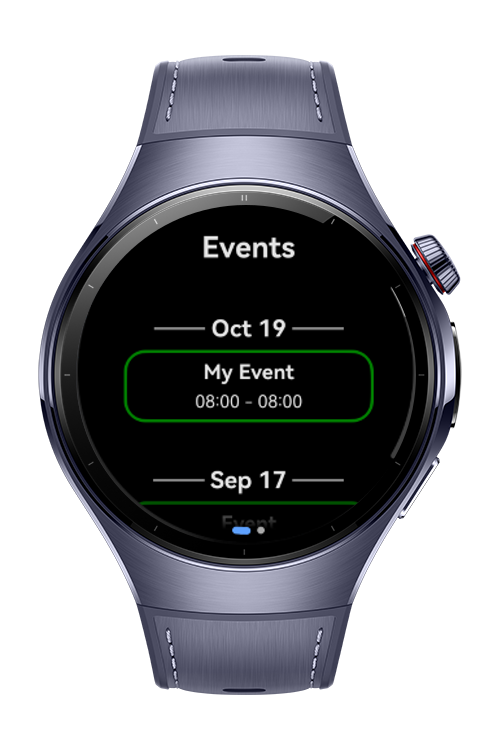
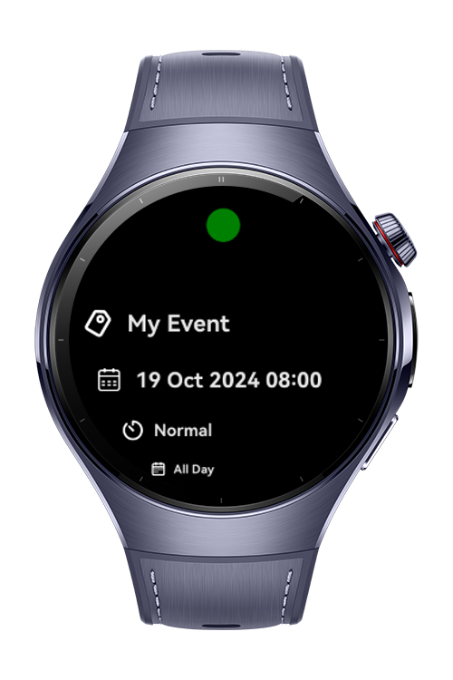
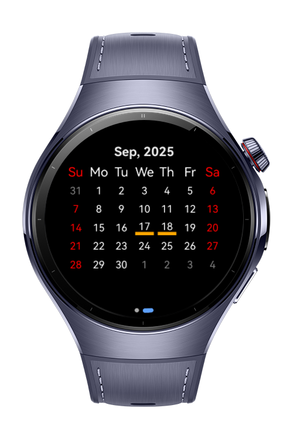
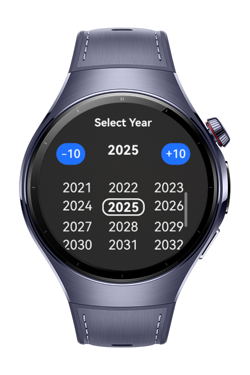

> **Note:** To access all shared projects, get information about environment setup, and view other guides, please visit [Explore-In-HMOS-Wearable Index](https://github.com/Explore-In-HMOS-Wearable/hmos-index).

# Event Calendar

**Event Calendar**  is a convenient app for users who want to view their personal calendar
and events on their smartwatch. It works by synchronizing with device calendar through Calendar Kit.

## Preview
<div>
  
  
  
  
</div>

## Use Cases

- Show events on the watch
- Can add events
- Manage calendar on the watch

## Tech Stack
- **Languages**: ArkTS, ArkUI
- **Frameworks**: HarmonyOS 5.0.39 Beta2 SDK
- **Tools**: DevEco Studio 6.0.0 Beta2
- **Libraries**:
    - `@kit.ArkUI`
    - `@kit.AbilityKit`
    - `@kit.BasicServicesKit`
    - `@kit.CalendarKit`
    - `dayjs`
  
## Required Permissions
- `ohos.permission.WRITE_CALENDAR`
- `ohos.permission.READ_CALENDAR`

## Directory Structure

```
entry/src/main/ets/
├───components
├───────Calendar
│           SmartCalendarPicker.ets
│           YearMonthSelector.ets
│       DayListItem.ets
│       EventDetailRowBuilder.ets
│       EventDot.ets
│       EventListItem.ets
│       EventsHeaderBuilder.ets
│       LoaderBuilder.ets
├───entryability
│       EntryAbility.ets
├───entrybackupability
│       EntryBackupAbility.ets
├───lib
│       constants.ts
│       types.ts
│       utils.ts
├───models
│       GlobalContext.ets
│       GlobalNavPathStack.ets
│       YearDataSource.ets
│       YearItem.ets       
├───pages
│       EventPage.ets
│       Index.ets
├───services
│       CalendarService.ets
│       EventService.ets
│       PermissionHandler.ets
├───viewmodels
│       Event.ets
│       GroupedEventModel.ets
│       ListDataSource.ets
├───views
│       EventView.ets
│       HomeView.ets
└─── 
```

## Constraints and Restrictions
## Supported Device
- Huawei Watch 5

## LICENSE
**EventCalendar** is distributed under the terms of the MIT License.
See the [license](LICENSE) for more information. 